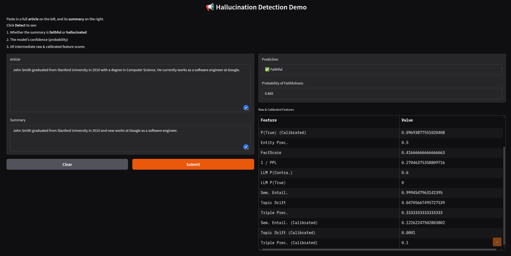

# Faithfulness Detector for Abstractive Summaries

* A cost‑effective, multi‑signal system for spotting hallucinations in abstractive news summaries — an end‑to‑end implementation of the research paper **“Cost‑Effective Hallucination Detection for LLMs”.*

---

## 1 · Overview

Built as a showcase‑level project, this repo demonstrates how to fuse **prompt‑based LLM probing, factual consistency metrics, and classical NLP signals** into a single calibrated predictor.  The pipeline:

1. **Generate signals**

   * Monte‑Carlo prompt pairing on *llama‑3‑1B* (accuracy vs. contradiction)
   * Inverse perplexity from *Flan‑T5*
   * Entity / SVO precision ("FactScore")
   * Cross‑encoder NLI gap + SBERT topic drift
2. **Isotonic‑calibrate** each raw score
3. **Logit‑space logistic regression** → probability of faithfulness
4. Expose both a **FastAPI** endpoint and a **Gradio** UI; fully containerised with **Docker Compose**.

---

## 2 · Approaches & Raw Features

| Code symbol                                   | Detector idea                                                                                          | Raw features                                         |
| --------------------------------------------- |--------------------------------------------------------------------------------------------------------| ---------------------------------------------------- |
| **Approach A – Prompt Pairing + Uncertainty** | Ask *llama‑3‑1B* two MC yes/no questions (accuracy & contradiction) + inverse perplexity from *Flan‑T5* | `p_true`, `p_contrad`, `inv_ppl`                     |
| **Approach B – FactScore**                    | Entity & SVO‑triple precision against the article (using spaCy)                                       | `fact_score`, `entity_precision`, `triple_precision` |
| **Approach C – Component‑based**              | (i) cross‑encoder NLI score (entail – contra) (ii) SBERT topic‑drift distance                          | `sem_entail`, `topic_drift`                          |

Each feature is independently **isotonic‑calibrated**, then passed through a **logit transform** and finally combined by the logistic regression.

---

## 3 · Getting Started

### 3.1 Docker Compose (recommended)

```bash

# spin up Ollama + application
docker compose up -d      # first run will download the models
```

Services

| Port      | Component               |
| --------- | ----------------------- |
| **11435** | Ollama (llama‑3‑1B)     |
| **8000**  | FastAPI – REST `/infer` |
| **7860**  | Gradio demo             |


### 3.2 Local Conda Environment

```bash
conda env create -f environment.yml
conda activate Faithfulness
python -m spacy download en_core_web_sm
ollama pull llama3.2:1b         

# run services
python app.py                            # Gradio  http://0.0.0.0:7860
uvicorn api:app --port 8000 --reload     # REST    http://0.0.0.0:8000/docs
```

Example cURL:

```bash
curl -X POST http://127.0.0.1:8000/infer \
     -H "Content-Type: application/json" \
     -d '{"article":"The Eiffel Tower is in Paris.","summary":"The Eiffel Tower is in Berlin."}'
```

---

## 4 · Re‑train / Evaluate

```bash
python src/driver_features.py        # writes xsum_*_raw.pq
python src/calibrate_and_meta.py     # produces configs/calibrators.pkl & meta.pkl
python src/evaluation.py             # evaluates on 150 CNN Daily Mail Faith examples
```

Artifacts are written to `configs/`:

* `calibrators.pkl` – dict feature→IsotonicRegression
* `meta.pkl` – logistic regression coefficients
* `threshold.txt` – default decision threshold τ = 0.45

---

## 5 · Scores

| Dataset                        | F1@τ=0.45 | AUROC | Brier |
| ------------------------------ |-----------| ----- | ----- |
| **XSum (test 200)**            | **0.218** | 0.741 | 0.235 |
| **CNN Daily Mail Faith (150)** | 0.715     | 0.951 | 0.453 |

---

## 6 · API Schema

```jsonc
POST /infer
{
  "article": "...",
  "summary": "..."
}
→
{
  "probability": 0.92,
  "predicted": 1,
  "raw_p_true": 0.40,
  ...
}
```

---

## 7 · File Map 

```
configs/           ← calibrators, meta, threshold
src/
  driver_features.py      feature extraction
  calibrate_and_meta.py   calibration + meta training
  inference.py            single‑pair inference
  …                       utilities for each detector
app.py              ← Gradio
api.py              ← FastAPI
Dockerfile          ← container for app service
start.sh            ← entry‑point (waits for Ollama)
```

---

## 8 · Gradio UI



---

## 9 · Citation & Credits

This implementation relies on open‑source models and datasets:

* **EdinburghNLP/XSum** for training labels
* **CNN Daily Mail Faith**  for cross‑dataset evaluation
* Hugging Face models: *Flan‑T5*, *llama‑3‑1B* (via Ollama), *cross‑encoder/nli‑deberta‑v3‑base*, *all‑MiniLM‑L6‑v2*
* **SpaCy framework** for entity & SVO‑triple precision

